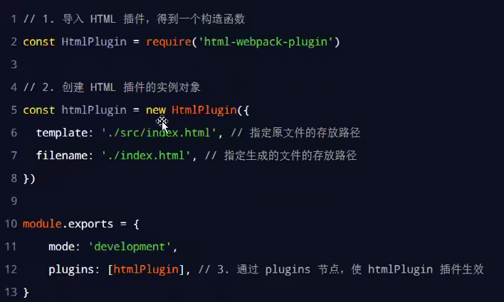
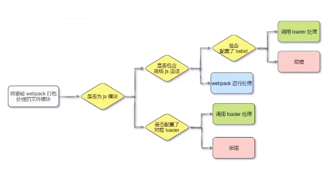

### webpack文档

#### 新建项目流程：


##### dependencies  : 生产运行依赖 -S or --save

##### devDependencies ：开发测试依赖  -D or --save-dev

#### 安装 webpack

- npm install webpack@5.42.1 webpack-cli@4.7.2  --save-dev

#### 配置webpack

1. 创建 webpack.config.js 文件 

```javascript
module.exports = {
    //mode代表webpack运行模式，有development和production
    mode:'development'
}
```

> ① development
>
> > - 开发环境
> > - 不会对打包生成的文件进行代码压缩和性能优化
> > - 打包速度快
>
> ② production
>
> > - 线上生产环境
> > - 会对打包生成的文件进行代码压缩和性能优化
> > - 打包速度慢

1. 在package.json 文件的scripts节点下，新增dev脚本：

```javascript
"scripts":{
    "dev":"webpack" //scripts下脚本通过 npm run dev or npm run 执行
}
```

3. 终端运行 npm run dev

#### webpack基础使用

##### 1.1 webpack中的默认约定

> ① 默认的打包入口文件 src ->index.js
>
> ②  默认的输出文件路径为 dist -> main.js
>
> attention：可以在**webpack.config.js** 中修改打包默认约定。

##### 1.2 修改默认打包约定

> - 在webpack.config.js 配置文件，通过entry 节点指定打包入口。通过output 节点指定打包出口。
>
> - example:
>
>   ```javascript
>   const path = require('path') // 导入操作node.js操作路径模块
>   module.exports= {
>       entry: path.join(__dirname,'./src/main.js'),//__dirname表示本文件所在目录
>       output:{
>           path:paht(__dirname,'./dist'),//指定生成文件存放路径
>           filname:'bundle.js'，//生成文件名
>       }
>   }
>   ```

##### 1.3 webpack 插件

1. webpack-dev-server （监听修改源码后webpack自动打包构建）

   ① 修改package.json ->scripts中的dev命   令：

   > ```javascript
   > "scripts": {
   >     "dev": "webpack-dev-server",
   >   },
   > ```

   ②  再次运行npm run dev 打包

   注意:（attention）：webpack-dev-server默认在项目根目录生成实时js文件，你需要引用它才能实时查看页面效果。

2. html-webpack-plugin（类似模板引擎，可以自定义index.html页面内容）

   > npm install html-webpack-plugin@5.3.2 -D

   > 
   >
   > 注意:html-webpack-plugin也会在指定目录下生成指定加载隐藏文件


3. loader加载器

   1. loader调用顺序

   > 

   > loader 例子：
   >
   > > ①npm i style-loader@3.0.0 css-l
   > > oader@5.2.6 -D
   > >
   > > 
   > >
   > > ②npm i less-loader@10.0.1 less@
   > > 4.1.1 -D

   ### 防止图片发起请求

> ##### 	图片base64转码（适合小体积图）：
>
> - 转码后体积变大
>
> - 解决因加载图片发起的二次请求
>
>   ##### 精灵图（把网站中需要的小图片合成一个大图片，通过图片的定位展示需要的小图片）：
>
> 2. 打包处理样式表中与url路径相关的文件
>
>    ① 运行 npm i url-loader@4.1.1 file-loader@6.2.0 -D
>
>    ② 在webpack.config.js 的 module -> rules 数组中，添加loader规则如下：
>
>    > 
>    >
>    > 其中 ？之后的是loader的选项：

> > > - limit用来指定图片的大小，单位为字节（byte）
> > > - 只有≤limit大小的图片，才会被转为base64格式的图片

> > 3. babel-loader
> >
> >    ① npm i  babel-loader@8.2.2  @babel/core@7.14.6  @babel/plugin-proposal-decorators@7.14.5  -D
> >
> >    ②在webpack.config.js的module ->rules s数组中，添加loader规则：
> >
> >    > 
> >
> >    ③创建babel.config.js文件，到官网查找相关配置，如：
> >
> >    > 
> >
> >    ④npm run dev

#### 1.4 发布

1. 打包

> 

2. 自动清理dist目录下的旧文件（clean-webpack-plugin）

   

   

#### 1.5 Source Map

1. 什么是source Map？

   > 

2. Source Map的问题

   > 

3. 解决source Map运行报错行和源代码行数不一样的问题

   > 

4. webpack 生产环境下的Source Map

   > 

5. 只定位行数不暴露源码(**推荐**)

   > 

5. 定位行数且暴露源码（<font color=red>**慎用**</font >）

   > 

6. @ 符号通过webpack配置代表 ’./src‘ 路径

   > 

