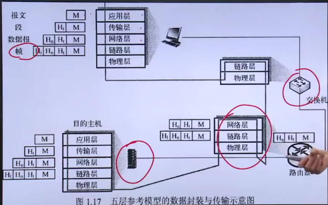
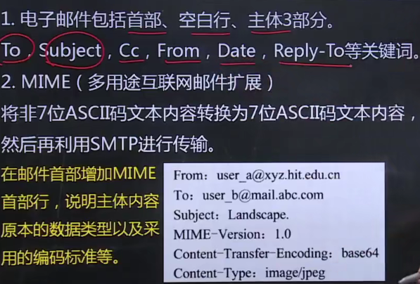
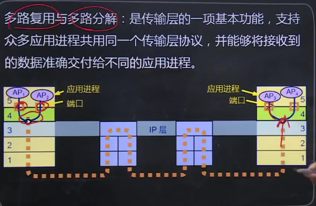

- <a href="#yyc">应用层</a>
- <a href ="#csc">传输层</a>
- 网络层
- 数据链路层
- 物理层

**基本概念：**

​	计算机网络是互连的、自治的计算的集合。

​	协议

1. 语法：实体之间交换信息的格式和结构
2. 语义：实体之间交换的信息中需要发（或包含）哪些控制信息的具体含义，以及针对不同含义的控制信息，接收信息端如何响应
3. 时序：实体之间交换信息的顺序以及如何匹配或适应彼此的速度

**计算机网络结构**

**数据交换技术**

**计算机网络性能**

**计算机网络体系结构**

1. OSI参考模型

   

2. TCP/IP参考模型**（实际参考模型）**

   ​                                                           

3. 五层参考模型

   

## <a id="yyc">计算机网络应用</a>

**应用体系结构 **

**网络应用通信基本原理**

 

**域名系统（DNS）**

1. 层次化域名空间

   

2. 域名服务器

   

   

3. 域名解析过程（实际是两种方式结合使用）

   

   - 递归查询原理

   

   - 迭代查询原理

   

**万维网应用**

1. 应用结构

   

   

2. HTTP

   

   

   

   

   HTTP请求报文

   

   HTTP请求报文类型

   

   HTTP响应报文 

   

   HTTP响应报文状态码

   

3. Cookie

   

   Cookie原理

   

**电子邮件**

1. 电子邮件系统结构

   

   具体原理

   

2. SMTP

   

3. 电子邮件格式与MIME

   

4. 邮件读取协议

   

**FTP（文件传送协议）**

1. FTP

   

**P2P应用**

1. P2P应用的优势

   

**Socket编程**

1. Socket接口模型

   

   基于TCP的Socket编程

   

   基于UDP的Socket编程

   

## <a id="csc">传输层</a>

**传输层的基本服务**

1. 传输层的基本功能

   

2. 传输层寻址与端口

   

3. 无连接服务与面向连接服务

   

**传输层的复用与分解**

1. 传输层的复用与分解

   

2. 无连接的多路复用与多路分解

   

3.  面向连接的多路复用与分解

   

**停-等协议与滑动窗口协议**

1. 可靠数据传输基本原理

   

2. 停-等协议

   

3. 滑动窗口协议

   

   

   

**UDP协议**

1. UDP数据结构

   

2. UDP校验和

   

**传输控制协议TCP协议**

1. TCP报文段结构

    

2. TCP连接管理

   

    

   

3. TCP可靠传输

   

4. TCP流量控制

   

5. TCP拥塞控制

   

